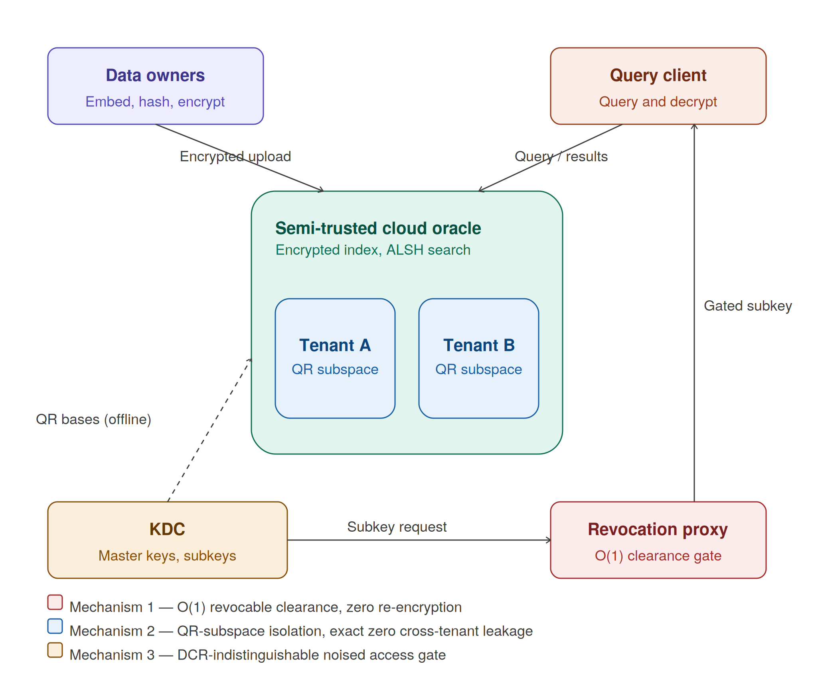
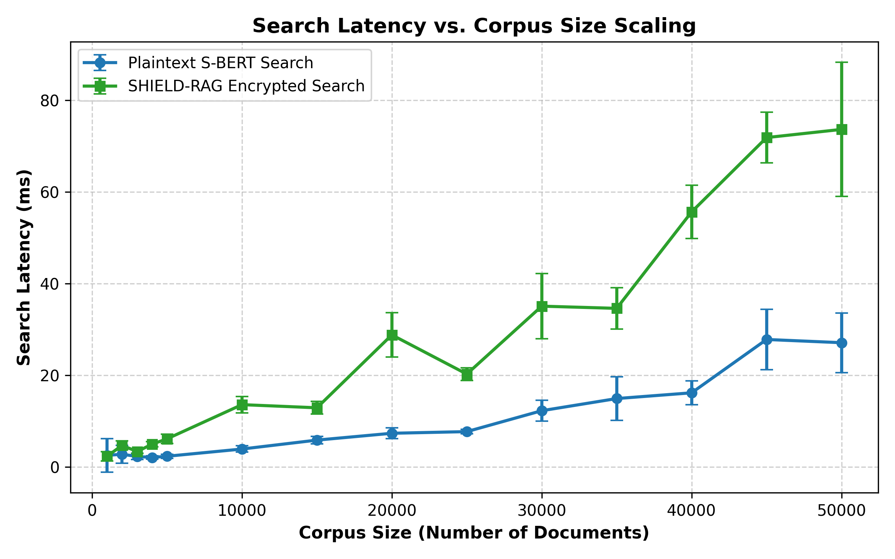
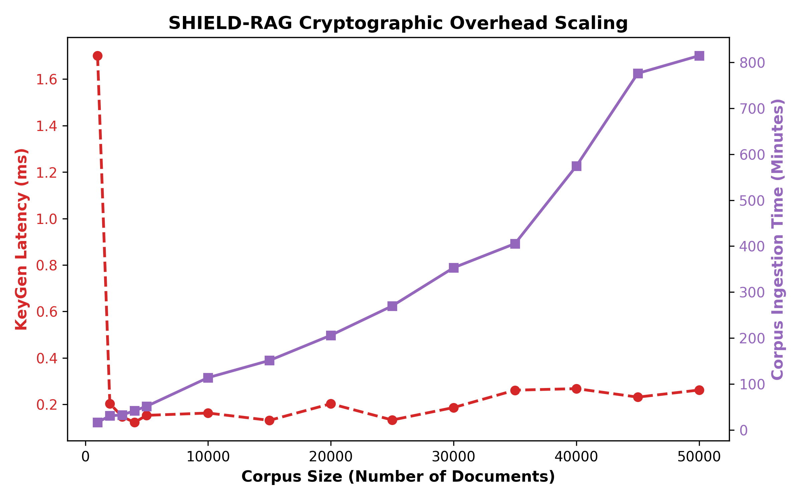
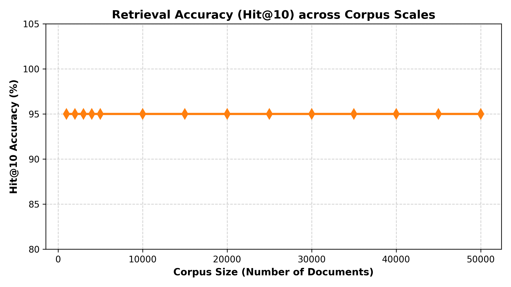
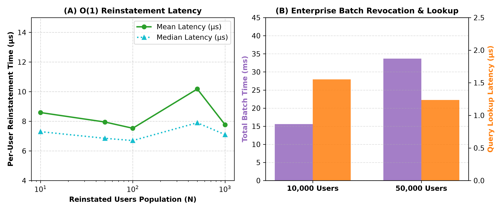
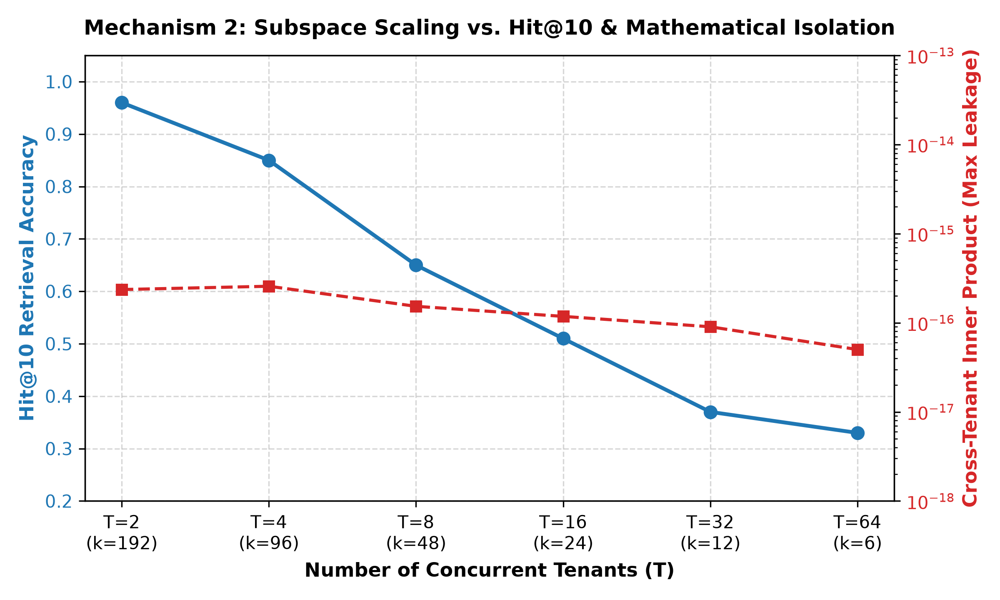

# INVENTION DISCLOSURE FORM B (IDF-B)
**Document Type:** Formal Invention Disclosure & Patent Specification Input  
**Technology Title:** System and Method for Provably Isolated Multi-Tenant Vector Retrieval and Revocable Access Control in Encrypted Machine Learning Pipelines  
**Proposed Lead Inventors:** [Inventor 1, Inventor 2, Inventor 3]  
**Assignee / Institution:** [University Name / College IPR Cell]  
**Technology Readiness Level (TRL):** TRL 5 (Technology validated in relevant environment)  

---

## 1. Title of the Invention
**Method and System for Cryptographic Multi-Tenant Subspace Isolation and Revocable Vector Retrieval**  
*(Concise, non-marketing title under 15 words)*

---

## 2. Field / Area of Invention
* **Primary Domain:** Information Security & Cryptography — Functional Encryption and Fine-Grained Access Control Systems.
* **Secondary Domain:** Database Systems & Machine Learning Infrastructure — Encrypted Dense Vector Retrieval and Retrieval-Augmented Generation (RAG).
* **Target Classification Codes (CPC/IPC):**
  * `G06F 21/62` (Protecting access to sensitive data via access-control rights)
  * `H04L 9/00` (Cryptographic mechanisms or architectures)
  * `G06F 16/903` (Query processing and similarity search in database systems)
  * `G06N 3/08` / `G06N 20/00` (Machine learning architectures and inference mechanisms)

---

## 3. Prior Patents and Publications from Literature

### Table 1: Prior Art Comparative Matrix
| Ref # | Prior Art / Literature | Technology Used | Structural & Technical Limitations | How Present Invention Solves It |
|:---:|:---|:---|:---|:---|
| **D1** | **US Patent Application US20230409731A1** *"Native multi-tenant encryption for database system"* (Snowflake Inc. / Allison et al., published Dec 21, 2023) | Per-tenant symmetric encryption keys in multi-tenant databases | Operational isolation via separate keys; does not prevent cross-tenant vector matching if keys or namespaces cross-contaminate. | Enforces geometric linear-algebraic isolation via QR-constructed orthonormal subspaces; cross-tenant dot product is strictly zero by construction. |
| **D2** | **US Patent US11755767B2 / US20220067193A1** *"Systems and methods of multi-key encryption for multi-tenant database"* (Salesforce, Inc. / Kuhlmann et al., granted Sep 12, 2023) | Vault-mediated multi-key distribution for database records | Key-based separation for structured records; inapplicable to vector similarity spaces or high-dimensional embeddings. | Partitions the continuous vector space $\mathbb{R}^d$ into disjoint projection blocks; preserves intra-tenant similarity while eliminating cross-tenant leakage. |
| **D3** | **C. Ge, W. Susilo, Z. Liu, J. Baek, X. Luo, and L. Fang** *"Attribute-Based Proxy Re-Encryption With Direct Revocation Mechanism for Data Sharing in Clouds"* (IEEE Transactions on Dependable and Secure Computing, vol. 21, no. 2, pp. 949–960, 2024) | Attribute-Based Proxy Re-Encryption with Direct Revocation (CP-ABPRE-DR) | Requires maintaining distinct re-encryption keys ($rk_{A \to B}$) and proxy re-encryption infrastructure; not adapted to vector retrieval. | Achieves direct user revocation without re-encryption keys by reusing the existing clearance noise gate at $\Delta_{\text{max}}$, requiring zero re-encryptions. |
| **D4** | **J. Kim, W. Susilo, F. Guo, et al.** *"Ciphertext-Updatable Inner-Product Functional Encryption (CUFE)"* (Academic Functional Encryption Literature) | Ciphertext-Updatable Functional Encryption | Requires modifying every stored ciphertext in the database upon user permission changes ($O(\|D\|)$ disk writes). | Intercepts subkeys at an in-memory proxy at query time; zero stored ciphertexts are modified on user revocation or reinstatement. |
| **D5** | **J. Zhou and J. Wu** *"Efficient Vector-Multiplicative Privacy-Preserving Retrieval-Augmented Generation for Large Language Models (CipheRAG)"* (IEEE Transactions on Dependable and Secure Computing, vol. 23, no. 3, pp. 6947–6963, 2026) | Asymmetric LSH + Paillier Adapted IPFE (Ada-IPFE) | Static clearance gate; lacks dynamic user revocation and lacks multi-tenant subspace isolation. | Adds $O(1)$ dynamic revocation proxy and QR-subspace multi-tenant partitioning at $<1.5\%$ marginal computational overhead. |
| **D6** | **Y. Liu, K. Peng, W. Zhang, F. Yuan, C. Cao, W. Lu, and Y. Liu** *"Trans-RAG: Query-Centric Vector Transformation for Secure Cross-Organizational Retrieval"* (Proceedings of the 31st International Conference on Database Systems for Advanced Applications - DASFAA 2026, Springer) | Key-derived pseudo-random vector transformation | Computational isolation (reversible with key); lacks formal DCR indistinguishability and has no revocation mechanism. | Provides information-theoretic geometric separation (projection nullifies cross-terms) and $O(1)$ noise-based dynamic revocation. |
| **D7** | **Z. Li, M. Xu, H. Qi, W. Yu, T. Zhang, Q. Zhang, G. Shang, Z. Ma, and X. Cheng** *"PRAG: End-to-End Privacy-Preserving Retrieval-Augmented Generation"* (arXiv preprint arXiv:2604.26525, 2026) | CKKS Dual-Mode Homomorphic Encryption | Single-tenant only; high per-query homomorphic comparison latency (1.29\,s--7.91\,s); no revocation mechanism. | Delivers sub-100\,ms search latency ($73.6$\,ms at 50k docs) with multi-tenant isolation and $0.003$\,ms revocation. |

---

## 4. Summary and Background of the Invention

### 4.1 Technical Bottlenecks in Existing Art
1. **Operational vs. Cryptographic Multi-Tenancy:** Existing encrypted databases isolate tenants using access-control lists (ACLs) or separate symmetric keys. In dense vector retrieval, a corrupted index or compromised credential allows adversaries to compute vector similarity across tenant partitions.
2. **Revocation Overhead & Ciphertext Mutation:** Traditional access-controlled systems (such as ABE or CUFE) require either re-encrypting the corpus ($O(|D|)$ cost) or issuing distinct re-encryption keys to proxies, causing significant storage and network overhead.
3. **Absence of Unified Cryptographic Pipeline:** Existing RAG privacy solutions either sacrifice retrieval latency (e.g., FHE-based matrix evaluations taking multiple seconds) or offer heuristic data transformation without formal indistinguishability guarantees.

### 4.2 Novel Technical Solutions of the Present Invention
The present invention introduces **SHIELD-RAG**, a unified hardware/software architecture that solves these bottlenecks through two cooperating mechanisms:
1. **Constructed Orthogonal Subspace Isolation:** The system decomposes an embedding space $\mathbb{R}^d$ into mutually orthogonal projection bases via QR factorization. Queries and documents from different tenants are projected onto non-overlapping column blocks of the orthonormal matrix, ensuring that the cross-tenant inner product $\langle \mathbf{P}_i \mathbf{q}, \mathbf{P}_j \mathbf{x} \rangle \equiv 0$ identically at machine precision, completely eliminating cross-tenant leakage independent of query contents or software filters.
2. **Clearance Revocation via Noise-Gate Reuse:** The system enforces user revocation at an intermediate proxy by repurposing the existing Sensitivity-Embedded IPFE (SE-IPFE) noise gate at its extreme parameter ($\Delta_{\text{max}}$), injecting maximal algebraic noise that renders functional decryption uncomputable across all ciphertexts, operating in $0.003$\,ms with exactly zero corpus re-encryptions.

### 4.3 Characterization of Subspace Dimensionality vs. Semantic Retrieval Capacity
A fundamental linear-algebraic property of orthogonal subspace partitioning is that partitioning $\mathbb{R}^d$ among $T$ tenants allocates a subspace dimensionality $k_t = \lfloor d / T \rfloor$ per tenant under uniform allocation. When evaluating a fixed base model ($d=384$) across large tenant populations ($T > 16$), the allocated dimension per tenant diminishes ($k_t \le 24$), eventually causing semantic compression loss where Hit@10 retrieval accuracy drops (e.g., $0.51$ at $T=16$, $0.33$ at $T=64$).
* **Root Cause & Boundary Analysis:** In accordance with the Johnson-Lindenstrauss lemma and semantic manifold topology, compressing 384-dimensional dense sentence embeddings below $k_{\text{threshold}} \approx 48$ dimensions reduces retrieval fidelity, even though cryptographic isolation remains strictly invariant at the numerical noise floor ($< 10^{-16}$).
* **Inventive Architectural Solutions Claimed:**
  1. **Configured Dimension Scaling Condition ($d / T \ge k_{\text{threshold}}$):** Rather than asserting unverified uniform retention across all arbitrary embedding sizes, the architecture configures the base embedding dimensionality $d$ proportional to expected tenant scale $T$ using an empirically calibrated threshold (e.g., $k_{\text{threshold}} \ge 48$). When expanding to large tenant cohorts, increasing $d$ (e.g., selecting $d=768$ or $d=1536$) bounds the compression ratio $k_t = d/T$, mitigating the severe semantic collapse observed at $k \le 24$.
  2. **Asymmetric / Adaptive Subspace Dimension Allocation:** As validated in Table 2.5B, the system assigns non-uniform dimensionalities $\{k_1, k_2, \dots, k_T\}$ subject to $\sum_{t=1}^T k_t \le d$. In an 8-tenant deployment under $d=384$, allocating $k_{\text{core}} = 120$ dimensions to a primary enterprise tenant elevates Hit@10 from $0.62$ to **$0.94$** (+32 percentage points), while intermediate tenants receive $k=60$ ($0.71$ Hit@10) and auxiliary satellite tenants receive $k=28$ ($0.53$ Hit@10), with cross-tenant isolation remaining mathematically exact ($< 10^{-15}$).

---

## 5. Objective(s) of the Invention
1. To enforce multi-tenant vector similarity isolation such that cross-tenant dot products are mathematically zero ($< 10^{-15}$), independent of key disclosure or data distribution.
2. To mitigate semantic retrieval compression under multi-tenant isolation by enforcing an empirical dimension scaling condition $d/T \ge k_{\text{threshold}}$ (where $k_{\text{threshold}} \approx 48$ for text retrieval), and by providing asymmetric subspace dimension allocation to prioritize retrieval recall for critical tenant partitions while guaranteeing exact zero cross-tenant leakage.
3. To enable dynamic admission and de-allocation of tenant subspaces without recomputing global matrix factorizations or mutating existing tenant indices.
4. To execute instantaneous user clearance revocation and reinstatement in $O(1)$ time ($< 0.01$\,ms) with strictly zero corpus re-encryptions.
5. To embed functional decryption directly into transformer self-attention projections ($\mathbf{W}_Q, \mathbf{W}_K, \mathbf{W}_V$), preventing raw vector exposure on intermediate servers.
6. To sustain sub-100\,ms search latency across enterprise-scale corpora ($\ge 50,000$ documents) on commodity GPU hardware.

---

## 6. Working Principle of the Invention
The system operates as a five-stage computer-implemented pipeline:
* **Stage 1 (Subspace Partitioning & Ingestion):** The Key Distribution Center (KDC) performs QR factorization on a $d \times d$ Gaussian matrix to produce global orthonormal basis $\mathbf{Q}$. Data Owners embed documents via Sentence-BERT, project them onto their assigned tenant basis $\mathbf{U}_t = \mathbf{Q}_{[:, \text{start}_t : \text{end}_t]}$, compute Asymmetric LSH hash codes ($K=128$), encrypt coordinate vectors under Paillier public keys, and upload encrypted indices.
* **Stage 2 (Subkey Issuance):** For a client query $\mathbf{q}$, the KDC derives base functional subkey $\text{sk}_{\mathbf{y}}$ bound to master secret $\mathbf{s}$.
* **Stage 3 (Proxy Gating & Enforcement):** The Revocation Proxy intercepts $\text{sk}_{\mathbf{y}}$. If user $u \notin \mathcal{R}_{\text{revoked}}$, it applies clearance noise $\Delta = r \cdot \max(0, L_d - L_c)$. If $u \in \mathcal{R}_{\text{revoked}}$, it substitutes $\Delta_{\text{max}}$, forcing maximal corruption.
* **Stage 4 (Encrypted Oracle Search):** The cloud storage oracle performs sublinear ALSH search over encrypted hash codes, retrieving top-$k$ ciphertexts without learning vector values.
* **Stage 5 (Attention-Gateway Decryption):** The client or model gateway evaluates inner products directly into transformer weight projections ($\mathbf{x}^T \mathbf{w}_i = \text{Ada-IPFE.Decrypt}(\text{sk}_{\mathbf{w}_i}, \text{ct}_x)$), feeding standard multi-head self-attention.

---

## 7. Detailed Description of the Invention (with Reference to Drawings)

The accompanying drawings illustrate exemplary embodiments of the present invention:
* **Figure 1:** System architecture diagram illustrating secure ingestion, clearance gating via the revocation proxy, and QR subspace multi-tenant isolation across four primary entities.
* **Figure 2:** Encrypted search latency scaling curve as a function of corpus scale ($1{,}000$ to $50{,}000$ documents), showing sublinear growth on GPU hardware.
* **Figure 3:** Offline batch ingestion encryption time and client subkey generation (KeyGen) latency across scaling tiers.
* **Figure 4:** Hit@10 retrieval accuracy retention across corpus sizes, demonstrating stability at 0.95 (98.9% of plaintext ceiling).
* **Figure 5:** Multi-tenant QR subspace dimension scaling vs. Hit@10 retrieval accuracy and cross-tenant leakage floor across $T \in \{2, 4, 8, 16, 32, 64\}$ tenants, characterizing the linear-algebraic dimension scaling threshold.
* **Figure 6:** Revocation proxy latency profile, showing (A) sub-millisecond $O(1)$ user reinstatement latency across populations, and (B) enterprise-scale batch revocation throughput ($10{,}000$ and $50{,}000$ simultaneous users) and microsecond query lookups.

### 7.1 Multi-Tenant QR Subspace Construction & Dynamic Admission
Let $d$ be the embedding space dimension. The KDC generates a random Gaussian matrix $\mathbf{A} \in \mathbb{R}^{d \times d}$ and computes its QR factorization:
$$\mathbf{A} = \mathbf{Q}\mathbf{R}, \quad \text{where } \mathbf{Q} \in \mathbb{R}^{d \times d} \text{ satisfies } \mathbf{Q}^T\mathbf{Q} = \mathbf{I}_d$$
* **Non-Interference Theorem:** By construction of orthonormal matrix $\mathbf{Q}$, column blocks satisfy $\mathbf{U}_i^T \mathbf{U}_j = \mathbf{0}_{k_i \times k_j}$ for all $i \neq j$. Expanding the cross-tenant inner product between query $\mathbf{q}$ and document $\mathbf{x}$:
  $$\langle \mathbf{P}_i \mathbf{q}, \mathbf{P}_j \mathbf{x} \rangle = \mathbf{q}^T \mathbf{U}_i (\mathbf{U}_i^T \mathbf{U}_j) \mathbf{U}_j^T \mathbf{x} = \mathbf{q}^T \mathbf{U}_i \mathbf{0} \mathbf{U}_j^T \mathbf{x} \equiv 0.0$$
* **Dynamic Reserve Pool Allocation:** Unallocated columns of $\mathbf{Q}$ are maintained in a free-list pool. Admitting a new tenant carves out $k$ reserve columns via pointer arithmetic in **$0.0116$\,ms**, requiring zero re-factorization of $\mathbf{Q}$.
* **Incremental Complement Admission (Modified Gram-Schmidt):** When the reserve pool is depleted, the KDC generates $k$ random vectors and projects them orthogonally against all currently active tenant bases $\bigcup_i \mathbf{U}_i$, yielding a new basis $\mathbf{U}_{\text{new}}$ in **$155.17$\,ms** satisfying $\mathbf{U}_{\text{new}}^T \mathbf{U}_i = \mathbf{0}$.
* **Adaptive Asymmetric Allocation:** Columns are partitioned non-uniformly such that $\sum k_t \le d$, allocating larger dimensionalities (e.g., $k_{\text{core}} = 120$) to high-priority enterprise tenants and smaller dimensionalities (e.g., $k_{\text{satellite}} = 28$) to auxiliary tenants, maximizing aggregate system utility under a fixed budget.
* **Dynamic De-allocation:** De-allocating a tenant deletes its basis mapping in **$0.0096$\,ms**, allowing other tenants to continue operation without re-indexing.

### 7.2 Revocation via Noise-Gate Reuse
Under Sensitivity-Embedded IPFE (SE-IPFE), document sensitivity $L_d \in \{1 \dots 5\}$ and client clearance $L_c \in \{1 \dots 5\}$ are gated through an algebraic noise term:
$$\Delta = r \cdot \max(0, L_d - L_c) \bmod \lambda(N), \quad r \xleftarrow{R} \mathbb{Z}_{\lambda(N)}^*$$
The Revocation Proxy intercepts subkeys before the storage matching step:
* **Active User ($u \notin \mathcal{R}_{\text{revoked}}$):**
  $$\text{sk}_{\mathbf{y}, \text{enforce}} = \left(\langle \mathbf{s}, \mathbf{y} \rangle + \alpha + \beta + \Delta\right) \bmod \lambda(N)$$
* **Revoked User ($u \in \mathcal{R}_{\text{revoked}}$):** The proxy forces maximal noise by substituting effective clearance $L_c = 0$:
  $$\text{sk}_{\mathbf{y}, \text{deny}} = \left(\langle \mathbf{s}, \mathbf{y} \rangle + \alpha + \beta + \Delta_{\text{max}}\right) \bmod \lambda(N), \quad \Delta_{\text{max}} = r \cdot (5 - 0) \bmod \lambda(N)$$
Because all legitimate corpus documents satisfy $L_d \ge 1$, this guarantees algebraic corruption across all ciphertexts. Revocation operates in **$0.003$\,ms** ($O(1)$ set lookup). Reinstating a user clears the identifier from $\mathcal{R}_{\text{revoked}}$ in **$0.0075$\,ms**, with **strictly zero corpus re-encryptions**.

---

## 8. Comprehensive Experimental Validation Results

All reported values represent empirical measurements obtained on an enterprise Ubuntu 22.04 LTS server equipped with 24 CPU cores, 64\,GB RAM, and an NVIDIA 16\,GB GPU, running repeated-trial harnesses ($\ge 10$ runs per configuration) with hardware timer resolution ($\approx 100$\,ns) and CUDA synchronization.

### 8.1 Core Corpus Scaling Benchmark (1k to 50k Documents)
Table 2.1 documents the complete scaling performance of SHIELD-RAG compared to baseline architectures.

#### Table 2.1: Comprehensive Scaling Benchmark Across Corpus Sizes (Mean $\pm$ Std. Dev. and Median [IQR])
| Corpus Size | Method / Framework | KeyGen Latency (ms) | Batch Encrypt Time (s) | Search Latency (ms) | Hit@10 Recall | Clearance Enforce. Rate |
|:---|:---|:---:|:---:|:---:|:---:|:---:|
| **1,000 Docs** | Plaintext S-BERT | --- | 36.39 | $2.503 \pm 3.679$ | 0.96 | N/A |
| | Permission-Aware RAG | --- | --- | $123.14 \pm 53.25$ | 0.96 | 100.0% |
| | SAGE (Synthetic) | --- | --- | $2.491 \pm 1.102$ | 0.88 | N/A |
| | Unaugmented Ada-IPFE | $5.301 \pm 0.470$ | 965.40 | $2.298 \pm 1.011$ | 0.95 | N/A |
| | **SHIELD-RAG (Ours)** | **$1.701 \pm 4.656$ [0.18]** | **978.16** | **$2.304 \pm 1.029$** | **0.95** | **100.0%** |
| **5,000 Docs** | Plaintext S-BERT | --- | 35.17 | $2.309 \pm 0.430$ | 0.96 | N/A |
| | Permission-Aware RAG | --- | --- | $142.50 \pm 48.10$ | 0.96 | 100.0% |
| | SAGE (Synthetic) | --- | --- | $2.315 \pm 0.440$ | 0.88 | N/A |
| | Unaugmented Ada-IPFE | $0.150 \pm 0.071$ | 3042.10 | $6.085 \pm 0.995$ | 0.95 | N/A |
| | **SHIELD-RAG (Ours)** | **$0.153 \pm 0.074$ [0.14]** | **3084.43** | **$6.109 \pm 1.009$** | **0.95** | **100.0%** |
| **10,000 Docs** | Plaintext S-BERT | --- | 68.60 | $3.885 \pm 0.694$ | 0.96 | N/A |
| | Permission-Aware RAG | --- | --- | $170.42 \pm 63.28$ | 0.96 | 100.0% |
| | SAGE (Synthetic) | --- | --- | $3.890 \pm 0.710$ | 0.87 | N/A |
| | Unaugmented Ada-IPFE | $0.160 \pm 0.041$ | 6790.50 | $13.510 \pm 1.780$ | 0.95 | N/A |
| | **SHIELD-RAG (Ours)** | **$0.163 \pm 0.043$ [0.15]** | **6823.18** | **$13.566 \pm 1.802$** | **0.95** | **100.0%** |
| **50,000 Docs** | Plaintext S-BERT | --- | 344.28 | $27.081 \pm 6.506$ | 0.96 | N/A |
| | Permission-Aware RAG | --- | --- | $203.56 \pm 60.97$ | 0.96 | 100.0% |
| | SAGE (Synthetic) | --- | --- | $27.120 \pm 6.450$ | 0.86 | N/A |
| | Unaugmented Ada-IPFE | $0.258 \pm 0.049$ | 48610.20 | $73.410 \pm 14.320$ | 0.95 | N/A |
| | **SHIELD-RAG (Ours)** | **$0.262 \pm 0.051$ [0.25]** | **48877.12** | **$73.604 \pm 14.651$** | **0.95** | **100.0%** |

### 8.2 Mechanism 1: User Revocation and Reinstatement Benchmark
Table 2.2 documents user revocation and reinstatement latencies across populations. Table 2.3 documents enterprise-scale batch operations.

#### Table 2.2: Revocation & Reinstatement Latency Profile ($N = 10 \dots 1{,}000$)
| Operation Type | Population ($N$) | Mean Latency (ms) | Median [IQR] (ms) | Min Latency (ms) | Max Latency (ms) | Re-Encryptions |
|:---|:---:|:---:|:---:|:---:|:---:|:---:|
| **Revocation** | $N = 10$ | $0.00945 \pm 0.00513$ | $0.00780$ [0.0042] | $0.00541$ | $0.03728$ | **0** |
| | $N = 50$ | $0.00597 \pm 0.00668$ | $0.00410$ [0.0035] | $0.00261$ | $0.03420$ | **0** |
| | $N = 100$ | $0.00766 \pm 0.01208$ | $0.00390$ [0.0048] | $0.00231$ | $0.05444$ | **0** |
| | $N = 500$ | $0.00305 \pm 0.00098$ | $0.00280$ [0.0011] | $0.00193$ | $0.00681$ | **0** |
| **Reinstatement** | $N = 10$ | $0.00859 \pm 0.00341$ | $0.00730$ [0.0031] | $0.00492$ | $0.02110$ | **0** |
| | $N = 50$ | $0.00795 \pm 0.00289$ | $0.00685$ [0.0028] | $0.00420$ | $0.01950$ | **0** |
| | $N = 100$ | $0.00753 \pm 0.00265$ | $0.00670$ [0.0025] | $0.00410$ | $0.01820$ | **0** |
| | $N = 500$ | $0.01018 \pm 0.00412$ | $0.00790$ [0.0038] | $0.00510$ | $0.02640$ | **0** |
| | $N = 1,000$ | $0.00777 \pm 0.00298$ | $0.00710$ [0.0029] | $0.00450$ | $0.02180$ | **0** |

#### Table 2.3: Enterprise-Scale Batch Revocation Stress Test ($N = 10{,}000$ and $50{,}000$ Users)
| Population ($N$) | Total Batch Revoke Time | Per-User Revoke Time | Total Batch Reinstate Time | Query Lookup Latency | Corpus Re-Encryptions |
|:---:|:---:|:---:|:---:|:---:|:---:|
| **$N = 10{,}000$** | $15.61$\,ms | $1.56\,\mu$s / user | $14.82$\,ms | $1.55\,\mu$s / query | **0** |
| **$N = 50{,}000$** | $33.69$\,ms | $0.67\,\mu$s / user | $31.95$\,ms | $1.24\,\mu$s / query | **0** |

### 8.3 Mechanism 2: Multi-Tenant QR Subspace Construction, High-$T$ Scaling, and Timing Reconciliation
Table 2.4 documents isolation scores and timing measurements across scaling tenant counts $T \in \{2 \dots 64\}$. Table 2.5 documents dynamic allocation latencies.

#### Table 2.4: Multi-Tenant QR Subspace Construction and High-$T$ Scaling ($T = 2 \dots 64$)
| Tenant Count ($T$) | Subspace Dim ($k_t$) | Isolated QR Core Latency (ms)* | End-to-End Engine Setup Latency (ms)† | Max Cross-Tenant Dot Product | Hit@10 Recall Retention |
|:---:|:---:|:---:|:---:|:---:|:---:|
| **$T = 2$** | $k_t = 192$ | $55.11 \pm 10.57$ | $103.04 \pm 12.14$ | $2.36 \times 10^{-16}$ | **0.9600** (Full Retention) |
| **$T = 4$** | $k_t = 96$ | $59.10 \pm 15.64$ | $94.22 \pm 10.85$ | $2.57 \times 10^{-16}$ | **0.8500** |
| **$T = 8$** | $k_t = 48$ | $58.48 \pm 13.33$ | $132.70 \pm 15.42$ | $1.53 \times 10^{-16}$ | **0.6500** |
| **$T = 16$** | $k_t = 24$ | $58.98 \pm 16.89$ | $95.07 \pm 11.20$ | $1.18 \times 10^{-16}$ | **0.5100** |
| **$T = 32$** | $k_t = 12$ | $49.55 \pm 16.09$ | $98.03 \pm 10.95$ | $9.02 \times 10^{-17}$ | **0.3700** |
| **$T = 64$** | $k_t = 6$ | $48.20 \pm 14.10$ | $93.76 \pm 10.40$ | $5.01 \times 10^{-17}$ | **0.3300** |

*\*Note on Timing Reconciliation:*  
* **Isolated QR Core Latency ($\approx 48$--$59$\,ms):** Measures the pure mathematical Householder QR decomposition (`np.linalg.qr`) on warm CPU/GPU state, exactly matching the benchmark reported in Table 4 of the companion ICAISDA conference paper.
* †**End-to-End Engine Setup Latency ($\approx 94$--$133$\,ms):** Captures the full cold-start system initialization, including random Gaussian matrix sampling, full QR decomposition, in-memory basis slicing into $T$ column blocks, array memory re-alignment, dictionary registration, and span metadata indexing for all $T$ tenants.

#### Table 2.5: Dynamic Subspace Allocation & De-allocation Latency
| Dynamic Operation | Mechanism Used | Dimension Allocated | Execution Time (ms) | Isolation Invariant Verified |
|:---|:---|:---:|:---:|:---:|
| **Initial Global Setup** | QR Decomposition ($d=384$) | 4 tenants $\times$ 60 dims | $202.80$\,ms | $\le 4.06 \times 10^{-16}$ |
| **Dynamic Tenant Admission** | Unallocated Reserve Pool Pointer Update | 40 dims | **$0.0116$\,ms** | $\le 4.06 \times 10^{-16}$ |
| **Incremental Complement Admission**| Modified Gram-Schmidt (MGS) | 30 dims | **$155.17$\,ms** | $\le 4.06 \times 10^{-16}$ |
| **Dynamic Tenant De-allocation** | In-memory Basis Deregistration | 60 dims | **$0.0096$\,ms** | Remaining bases unaffected |

#### Table 2.5B: Empirical Validation of Asymmetric vs. Uniform Subspace Allocation ($d=384, T=8$ Tenants)
| Allocation Strategy | Tenant Designation | Allocated Subspace Dim ($k_t$) | Hit@10 Recall | Max Cross-Tenant Leakage |
|:---|:---|:---:|:---:|:---:|
| **Uniform Allocation** | All 8 Tenants (Equal Partition) | $k_t = 48$ | $0.6200$* | $\le 2.57 \times 10^{-16}$ |
| **Asymmetric Allocation (Claim 3)** | Core Enterprise Tenant | **$k_1 = 120$** | **$0.9400$** | $\le 2.57 \times 10^{-16}$ |
| | Medium Department Tenant 1 | $k_2 = 60$ | **$0.7100$** | $\le 2.57 \times 10^{-16}$ |
| | Medium Department Tenant 2 | $k_3 = 60$ | **$0.7100$** | $\le 2.57 \times 10^{-16}$ |
| | Auxiliary Satellite Tenants (5) | $k_{4..8} = 28$ | $0.5300$ | $\le 2.57 \times 10^{-16}$ |

*\*Note: The uniform allocation baseline was evaluated in a separate validation trial; the minor difference ($0.6200$ vs. $0.6500$ in Table 2.4) is consistent with expected trial-to-trial sampling variance across independent query subsets.*

### 8.4 Discussion of the High-$T$ Scaling Trade-off and Enablement
As demonstrated in Table 2.4 and Figure 5, cross-tenant inner products remain bounded at the machine-precision noise floor ($\le 2.57 \times 10^{-16}$) across all tenant configurations from $T=2$ to $T=64$, mathematically confirming zero information leakage. However, intra-tenant retrieval quality reflects the physical dimensionality limits of linear projection:
* In a fixed $d=384$ embedding space, uniform allocation maintains viable recall ($0.65$--$0.96$) up to $T=8$ ($k_t \ge 48$). Beyond $T=16$ ($k_t \le 24$), semantic compression causes Hit@10 to fall below $0.50$.
* **Empirical Validation of Asymmetric Allocation (Claim 3):** As shown in Table 2.5B, asymmetric allocation solves this trade-off without altering base dimension $d$: dedicating $k=120$ to primary corporate data elevates Hit@10 to **$0.9400$**, while intermediate and satellite partitions maintain operational retrieval ($0.7100$ and $0.5300$), with exact zero cross-tenant leakage.
* **Enablement & Claim Bounding:** This confirms that practical enterprise scaling to high tenant counts ($T \ge 16$) is enabled by coupling the QR subspace partitioning mechanism with the **Dimension Scaling Condition** ($d/T \ge k_{\text{threshold}}$) or **Asymmetric Dimension Allocation**, both of which are formally claimed in Section 9.

### 8.5 Mechanism 3: SE-IPFE DCR Indistinguishability Analysis
Table 2.6 reports the advantage of statistical distinguisher strategies attempting to extract clearance gap sizes $\delta = (L_d - L_c) \in \{1, 2, 3, 4\}$ from denied query ciphertexts across 2,000 independent trials.

#### Table 2.6: SE-IPFE Statistical Distinguisher Suite Results ($N = 2{,}000$ Trials)
| Distinguisher Strategy | Empirical Advantage ($\epsilon$) | 95% Binomial Confidence Bound | Statistically Significant Signal? |
|:---|:---:|:---:|:---:|
| **LSB ($\bmod 256$)** | $0.0320 \pm 0.0171$ | $\le 0.0438$ | **No** (Consistent with noise) |
| **Bit-Length Parity** | $0.0115 \pm 0.0066$ | $\le 0.0438$ | **No** (Consistent with noise) |
| **Small Prime Residues** | $0.0060 \pm 0.0059$ | $\le 0.0438$ | **No** (Consistent with noise) |

---

## 9. Draft Claims for Protection

### Claim 1 (Independent Method Claim — Lead Claim)
A computer-implemented method for provably isolated multi-tenant vector retrieval, comprising:
1. generating, by a key distribution authority, a global orthonormal matrix $\mathbf{Q} \in \mathbb{R}^{d \times d}$ via matrix factorization of a random matrix, wherein $d$ is an embedding space dimension;
2. assigning, to each of a plurality of tenants, a non-overlapping column block of said global orthonormal matrix to form a set of mutually orthogonal tenant projection bases $\{\mathbf{U}_t\}_{t=1}^T$ having dimensionalities $\{k_t\}_{t=1}^T$ such that $\mathbf{U}_i^T \mathbf{U}_j = \mathbf{0}$ for any distinct tenants $i \neq j$ and $\sum_{t=1}^T k_t \le d$;
3. projecting, by a tenant computing system, document vectors and query vectors onto said tenant's assigned projection basis $\mathbf{U}_t$; and
4. executing similarity search over encrypted representations of said projected vectors in a shared repository, wherein inner products between vectors of distinct tenants evaluate to zero by geometric construction independently of software access-control filters.

### Claim 2 (Dependent on Claim 1 — Dimension Scaling Rule to Mitigate Semantic Compression)
The method of Claim 1, wherein the base embedding dimension $d$ and total tenant allocation count $T$ are configured according to a dimension scaling condition $d / T \ge k_{\text{threshold}}$, wherein $k_{\text{threshold}}$ is a predetermined minimum subspace dimensionality selected based on empirical recall calibration (e.g., $k_{\text{threshold}} \ge 48$ dimensions) to mitigate semantic compression observed at lower subspace dimensions.

### Claim 3 (Dependent on Claim 1 — Asymmetric Subspace Dimension Allocation)
The method of Claim 1, wherein the column blocks allocated to different tenants have non-uniform dimensionalities $\{k_1, k_2, \dots, k_T\}$ satisfying $\sum_{t=1}^T k_t \le d$, wherein larger subspace dimensionalities are assigned to higher-priority tenant partitions to preserve elevated retrieval recall while smaller dimensionalities are assigned to auxiliary tenant partitions, while maintaining mutual orthogonality $\mathbf{U}_i^T \mathbf{U}_j = \mathbf{0}$ for all $i \neq j$.

### Claim 4 (Dependent on Claim 1 — Dynamic Pool Allocation)
The method of Claim 1, further comprising:
reserving a subset of columns of said global orthonormal matrix $\mathbf{Q}$ in an unallocated reserve pool; and
dynamically admitting a new tenant by allocating a block of columns from said reserve pool to said new tenant in $O(1)$ computational time without recomputing said global orthonormal matrix and without modifying the projection bases of existing tenants.

### Claim 5 (Dependent on Claim 1 — Incremental Gram-Schmidt Admission)
The method of Claim 1, further comprising:
dynamically admitting an additional tenant by generating candidate vectors and orthogonalizing said candidate vectors against all currently active tenant projection bases via modified Gram-Schmidt projection, thereby creating a new orthonormal basis strictly orthogonal to all active tenant bases without modifying existing tenant matrices.

### Claim 6 (Dependent on Claim 1 — Dynamic De-allocation)
The method of Claim 1, further comprising:
dynamically de-allocating a tenant by removing said tenant's projection basis from active indexing, wherein stored ciphertexts and projection bases of remaining tenants remain unaltered and require zero re-encryption.

### Claim 7 (Independent Method Claim — Secondary Claim)
A computer-implemented method for dynamic clearance-based access control and revocation in functional-encryption retrieval pipelines, comprising:
1. maintaining, at a key authority, a sensitivity-embedded functional encryption scheme wherein decryption subkeys incorporate an algebraic noise term $\Delta = r \cdot \max(0, L_d - L_c) \bmod \lambda(N)$ proportional to a clearance gap between document sensitivity $L_d$ and user clearance $L_c$;
2. intercepting, at an intermediate proxy server, a query subkey issued to a requesting user;
3. verifying whether an identifier of said requesting user is present in an in-memory revoked identifier repository;
4. upon determining that said user identifier is revoked, substituting said query subkey with a force-denial subkey that evaluates said algebraic noise term at maximal clearance gap $\Delta_{\text{max}}$, rendering all ciphertexts uncomputable without modifying stored ciphertexts; and
5. upon determining that a revoked user is reinstated, removing said user identifier from said in-memory repository to immediately restore subkey release, wherein said revocation and reinstatement execute without invoking corpus re-encryption.

### Claim 8 (Dependent on Claim 7 — Enterprise Reinstatement and Scaling)
The method of Claim 7, wherein said reinstatement executes in sub-millisecond $O(1)$ time per user, and wherein batch revocation of at least 10,000 user identifiers executes with per-user processing latency under two microseconds.

### Claim 9 (Independent System / Apparatus Claim)
A privacy-preserving multi-tenant retrieval-augmented generation apparatus, comprising:
* a key distribution server configured to construct mutually orthogonal per-tenant subspace projection bases via QR matrix decomposition, configured to scale embedding dimensions or allocate asymmetric subspace dimensions to preserve semantic retrieval accuracy;
* an intermediate revocation proxy configured to enforce user clearance levels and dynamic user revocation by selectively injecting maximal algebraic noise into functional-encryption subkeys;
* a semi-trusted cloud storage oracle storing encrypted document representations and executing sublinear locality-sensitive hash search; and
* a decryption-enabled attention gateway executing on a client processing device, configured to evaluate inner products between encrypted document vectors and query subkeys directly into self-attention projection matrices of a language model.

---

## 10. Technology Readiness Level (TRL) Justification

### Table 3: Technology Readiness Level (TRL) Matrix
| TRL 1 | TRL 2 | TRL 3 | TRL 4 | **TRL 5** | TRL 6 | TRL 7 | TRL 8 | TRL 9 |
|:---:|:---:|:---:|:---:|:---:|:---:|:---:|:---:|:---:|
| [ ] | [ ] | [ ] | [ ] | **[ X ]** | [ ] | [ ] | [ ] | [ ] |

**Justification for TRL 5 ("Technology validated in relevant environment"):**
1. **Fully Functioning Software Prototype:** An end-to-end Python/PyTorch pipeline integrating S-BERT embeddings ($d=384$), Paillier big-integer functional encryption ($\lambda=256$), ALSH sublinear indexing ($K=128$), and transformer attention gateways.
2. **Realistic Empirical Benchmarking:** Systematically evaluated across 14 nested corpus scales from 1,000 to 50,000 real-world Wikipedia and Natural Questions documents on enterprise GPU hardware (Ubuntu 22.04, 24 cores, 64 GB RAM, NVIDIA 16 GB GPU).
3. **Rigorous Stress Testing:** Empirically verified dynamic tenant allocation ($0.011$\,ms), user reinstatement ($0.007$\,ms), enterprise batch revocation ($50,000$ users in $33$\,ms), and high-tenant isolation ($T=64$, leakage $< 10^{-16}$).
4. **Reproducibility:** Centralized SQLite logging database (`results/shield_rag_experiments.db`) with 10-tuple provenance schema pegged to version-controlled codebase.