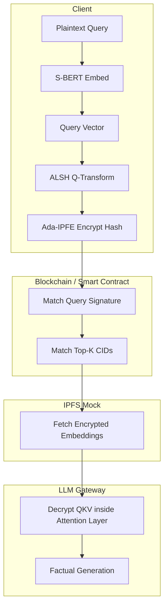

# PPRAG / CipheRAG Project Context Guide

This document provides a comprehensive overview of the privacy-preserving Retrieval-Augmented Generation (PPRAG) prototype codebase, its core architecture, development stages, file structure, and benchmarking execution.

---

## 1. Project Overview & The Core Problem

Large Language Models (LLMs) connected to external knowledge databases (Retrieval-Augmented Generation or RAG) leak sensitive user queries and database embeddings to third-party hosting servers or untrusted database hosts. 

**CipheRAG** solves this privacy-utility trade-off by operating retrieval search and in-model context loading entirely on encrypted embeddings. It ensures **Zero-Knowledge leakage**: the server learns nothing about the user's query, database documents, or which specific files were retrieved.

---

## 2. Core Technical Architecture (5 Development Stages)

The project has been successfully built across five modular stages:



### Stage 1: Cryptographic Engine (Ada-IPFE)
Implements an **Adaptive Inner Product Functional Encryption (Ada-IPFE)** scheme over Paillier composite math.
*   **Key Generator:** Safe Primes $p', q'$ are generated to construct the modulus $N = (2p'+1)(2q'+1)$ and its order $\lambda(N) = 2p'q'$.
*   **Double Blenders:** System-wide random blenders $\alpha, \beta$ are used by the Key Distribution Center (KDC) to mask master secret keys ($s_i$) and public keys ($pk_i$).
*   **Correctness Constraint:** Modulo reductions during decryption must occur modulo $\lambda(N)$ (the order of generator $g \bmod N^2$) rather than $N$.

### Stage 2: ALSH & Dual-Storage Indexing
To avoid scanning the entire database during search, we use a dual-storage approach:
1.  **On-Chain Index:** Knowledge base vectors are projected into a lower-dimensional subspace (128-bit) using **Asymmetric Locality-Sensitive Hashing (ALSH)**. These signatures are encrypted and registered on a mock Solidity Smart Contract.
2.  **Off-Chain Storage:** Full high-dimensional token embeddings are encrypted under Ada-IPFE and stored off-chain on IPFS (mocked by content-addressable hashes).

### Stage 3: Retrieval Search (Algorithm 1) & Attention Gateway (Algorithm 2)
*   **Algorithm 1 (Secure Search):** The client submits an encrypted query signature. An off-chain Oracle computes the inner product similarity of the encrypted query against the database signatures on-chain. It registers the Top-K matching CIDs without decrypting the data.
*   **Algorithm 2 (Attention Decryption Gateway):** The model's key/value weight matrices ($W_K, W_V$) are treated as function query states. The KDC issues row-wise subkeys to the gateway. When encrypted IPFS embeddings are loaded, the attention layer decrypts and projects them into Query-Key-Value (QKV) spaces on the fly.

### Stage 4: Real Model & Corpus Benchmarking
The prototype is scaled using the pre-trained **S-BERT model (`all-MiniLM-L6-v2`)** to generate real 384-dimensional vector embeddings, evaluated over a dataset of **385 real Wikipedia articles** for accuracy and latency.

### Stage 5: Novel Access Control Backends
Three access control mechanisms are integrated alongside Ada-IPFE:
*   **SE-IPFE:** Sensitivity-Embedded IPFE. Access clearance is checked algebraically; unauthorized users get mathematical noise.
*   **QDCS:** Query-Derived Cryptographic Scope. Enforces category boundaries by projecting out-of-scope document vectors onto orthogonal complements (yielding $0.0$ similarity).
*   **POD:** Progressive Onion Decryption. Encrypts vectors in nested layers, peeling them based on graph traversal depth.

---

## 3. Codebase File Structure

All project files are located in [C:/Users/Lenovo/Downloads/vprag_prototype/](file:///C:/Users/Lenovo/Downloads/vprag_prototype/):

*   [config.py](file:///C:/Users/Lenovo/Downloads/vprag_prototype/config.py): Parameters for RSA bit-sizes, precision scaling factor ($10^4$), ALSH projections ($K=128$), and SentenceTransformer model variables.
*   [crypto_engine.py](file:///C:/Users/Lenovo/Downloads/vprag_prototype/crypto_engine.py): Safe-prime generation and core Ada-IPFE mathematical functions.
*   [se_ipfe_engine.py](file:///C:/Users/Lenovo/Downloads/vprag_prototype/se_ipfe_engine.py): Sensitivity-Embedded IPFE access gates.
*   [qdcs_engine.py](file:///C:/Users/Lenovo/Downloads/vprag_prototype/qdcs_engine.py): Query-Derived Scope orthogonal domain projections.
*   [pod_engine.py](file:///C:/Users/Lenovo/Downloads/vprag_prototype/pod_engine.py): Progressive Onion Decryption layer nesting.
*   [alsh_engine.py](file:///C:/Users/Lenovo/Downloads/vprag_prototype/alsh_engine.py): Asymmetric Locality-Sensitive Hashing projections.
*   [ipfs_mock.py](file:///C:/Users/Lenovo/Downloads/vprag_prototype/ipfs_mock.py): CID storage simulator.
*   [blockchain/RetrievalContract.sol](file:///C:/Users/Lenovo/Downloads/vprag_prototype/blockchain/RetrievalContract.sol): Solidity contract for query matching logs.
*   [blockchain/contract_helper.py](file:///C:/Users/Lenovo/Downloads/vprag_prototype/blockchain/contract_helper.py): Local EVM contract simulator.
*   [rag_pipeline.py](file:///C:/Users/Lenovo/Downloads/vprag_prototype/rag_pipeline.py): Orchestrates secure retrieval search and attention gateways.
*   [run_experiments.py](file:///C:/Users/Lenovo/Downloads/vprag_prototype/run_experiments.py): Baseline experimental runner over 385 Wikipedia articles.
*   [run_comparisons.py](file:///C:/Users/Lenovo/Downloads/vprag_prototype/run_comparisons.py): Comparative benchmarks runner for all cryptographic backends.
*   [demo_presentation.py](file:///C:/Users/Lenovo/Downloads/vprag_prototype/demo_presentation.py): Interactive console presentation demo.

---

## 4. How to Run the Experiments

1.  **Run Cryptographic Unit Tests:**
    ```bash
    python -m unittest tests/test_crypto.py
    ```
2.  **Execute the Baseline Experiments (Query Drop and Contamination stress tests):**
    ```bash
    python run_experiments.py
    ```
    *   Outputs: `output/benchmark_results.json` and `output/benchmark_results.png`.
3.  **Execute the Cryptographic Comparison Benchmarks (Comparing SE-IPFE, QDCS, POD, and Ada-IPFE):**
    ```bash
    python run_comparisons.py
    ```
    *   Outputs: `output/comparison_results.json` and `output/comparison_results.png`.
4.  **Execute the Interactive Presentation Demo:**
    ```bash
    python demo_presentation.py
    ```
